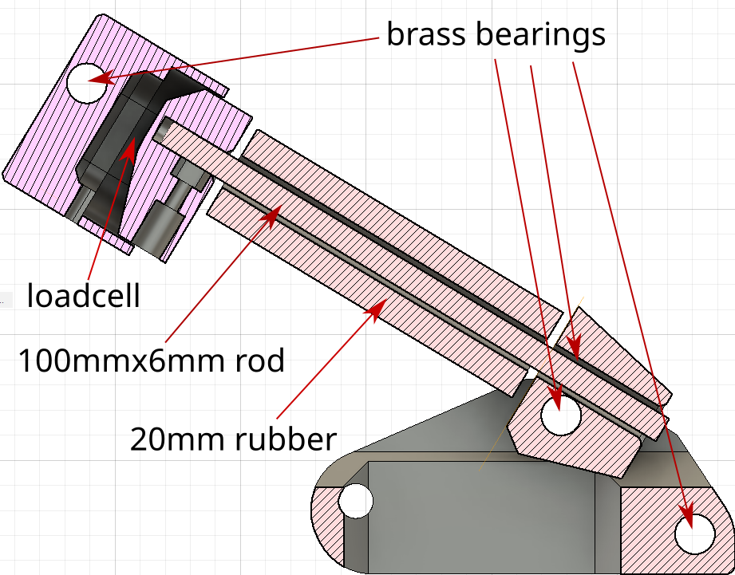

# fanatec csl DIY loadcell mod
DIY Loacell Mod for Fanatec CSL Pedals


## why?

Why not? :D ...

Was thinking, why not build cheap good loadcell pedals. Thanks to fanatec to create new pedals with the possibility to easy mod.

Currently you would pay 200€ for the Loadcell pedal kit. With this mod, you mostly around 110-120€ in total (80€ csl pedals + 40€ loadcell mod).

## limitation/bad things

### resolution

Think default fanatec wheelbase has 12 bit and usb 16 bit, so you get a little less resolution.

- 10 bit arduino resolution
  - for hall sensor (200-900 analog read) - it's fine.
  - opamp load cell (520-1000 analog read) - it's more like a 9 bit, with removing noice 8 bit resolution


### timing/samples per second

Don't know any details from the fanatec pedals, can only mention what you will get.

`Joystick.sendState();` takes around 1ms. So you get around 900-1000Hz. 

One reason, I use not a HX711 LoadCell Amp, is the slow sample rate. Default 10Hz and with changed resistor 80Hz.
With the INA333 Op-Amp, from the data sheet you can get G=1 150Khz to G=1000 350hz. The used resisitor value  in my case (200Ohm) G=~500, should be near 700Hz.

The board with a build a smd potentiometer are hard to tune for low ohm values. Maybe you get the value (lowest I could hit was 160Ohm). Or solder a resitor at the smd pads. Or maybe better a good trim potentiometer, related with the resitor you can tune the gain, and related to this the needed force for max values. 200Ohm mean for me around 40kg of force.

## BOM

- arduino pro mirco - 11€
- INA333 board - 5€
- brass tubing (8x0.5mm) for the "bearings" - 3€
- 100mmx6mm tube/rod for the guide of the dampener rubber - 3€ (2pcs) - used RC Car HSS Rods
- 4x 12mm 20x8mm dampener rubber (shore 65) - unknow (used existing ones)
- 3x M6x60mm screw - 3€ (10pcs)
- 3x M6 Nuts (nylon, to avoid becoming loose over time) - 3€ (10 pcs)
- 1x 50Kg load cell - 12€ (10pcs)
- 8x 3x12mm wood flat head screws - 4€ (50Pcs)
- some 6mm washer
- wire/perfboard

Total costs: ~38€


## printing

I printed all parts with 5 shells,top and bottom layers and an infill of 40%.
The mounting for the loadcell in using only compression forces and the bearing for the rod too. Only the mounting for the "bearing of the rod", will get some pulling forces, but is also the thickes part.

Printing times for me:
- all spacer ~ 1h
- loadcell bearing ~ 1h 20m
- rod bearing ~ 20m
- pushplate ~ 35m
- bottom parts ~ 4h (each around 2h)

Total: 6h 15m

## assemble



### loadcell mount

After printing, extend the mounting hole to 8mm, and push the brass tube throw. It's act as a bearing to avoid heavy usage on the plastic.

### botton mounting

Both halfs, get connected on the rear end with a long (47mm) pice of brass tube.
The Front hole goes throw the first hole in the pedal. (seconds is also possible, but need more rubber and maybe a longer rod)

The mounting for the "bearing of the rod", get 2x 10mm brass tube.
And the "bearing" for the rod bearing get also 2x brass tube (23mm and 25mm).

### wiring


#### hall sensor

```
  Vcc -> Vcc (left pin)
  GND -> GND (right pin)
  A3 -> Signal (middle pin)
```

#### INA333

```
  Vcc -> 3.3V (but also work with 5V)
  GND -> GND
  A0 -> Vout
```
```
  Vcc -> White wire (R1 pin)
  GND -> Black wire (R2 pin)
  V+ -> red wire
  V- -> half of the voltage devider (both R1 and R2)
```
## code

Nothing complicated here. But some meantions.

### libs

thx for the creators and maintainers.

- [arduino joystick lib](https://github.com/MHeironimus/ArduinoJoystickLibrary)
- [arduino multi map lib](https://github.com/RobTillaart/MultiMap)

### code infos

- possibility to overwrite the pedal behavior with a non linear map
  - not used yet, hall sensor is nearly linear (only beginning and end is around 3% off from the expected value (tested with a digital angle indicator))
  - don't know if for a loadcell this has any benefit, but it's should be possible
- load cell smoothing
  - to avoid jitter from the analog read, if the value change is not big, it's average out over 50 samples (49 + 1). means 50ms.
  - if the change is bigger than 40 voltage steps, it's takes 2 + 1 samples
